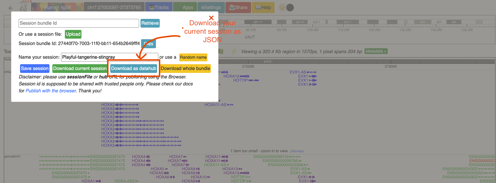
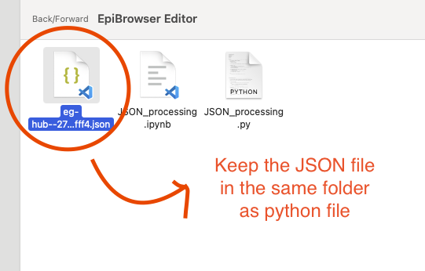
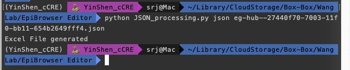
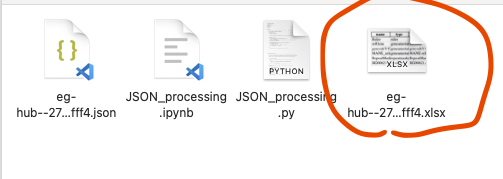
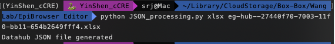
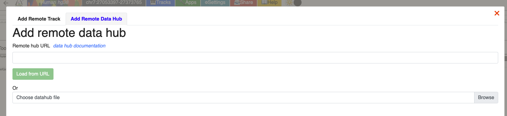

### WashU EpiGenome Browser Track Editor
Using a small Python script, you can convert your browser track into a excel sheet. This will allow you to edit any options/metadata/color/url for the track individually or groupwise using existing excel techniques. For example, you can change the color or add metadata for different celltypes by dragging and dropiping in the excel. You can also directly add new track by adding a new row in the excel sheet. 

The steps are easy.
1. Download your browser session as ``` json ``` file.
2. Put the ``` .json ``` file in the script folder and run the following command
```` bash 
python JSON_processing.py json your_file.json
````

3. This will generate an excel file (``` .xlsx```) in the same directory as ``` your_file.xlsx```. Voila, now edit as much as you want. 
4. (Optional) You might see an error if you don't have ``` openpyxl ``` installed. In that case, run the following command to install the library.

```` bash
pip install openpyxl
````


5.  If you are done editing, run the following command to convert it back to browser datahub format.

```` bash 
python JSON_processing.py xlsx your_file.xlsx
````

6. Upload to the browser and see the change!

### How to add new metadata

*  Add a column in your Excel sheet and name it like ```metadata.YOUR FIEILD.Name```. Optionally, you can add color for the field by adding another column named ```metadata.YOUR FIEILD.Color```, where ```YOUR FIELD``` is the metadata you want to add.

See the attached screenshots if you have any problems.

1.


2.


3.


4.


5.


6.

